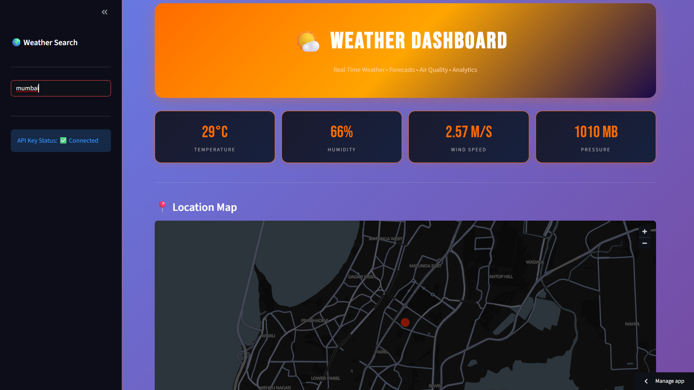

# Weather Dashboard 🌤️ | Real-Time Analytics

Real-time weather dashboard built with Python + Streamlit. Get current weather, 5-day forecasts, AQI data, and location-based analytics for any city worldwide using OpenWeather API.

### 🚀 Live Demo
**[Click Here to Check Live Weather](https://weather-dashboard-vyusgv8c5wobqqo7kua6p5.streamlit.app/)**

### 📸 Dashboard Preview


### 🌍 Current Data - Mumbai
- **Temperature**: 29°C | Feels Like 34°C
- **Condition**: Haze
- **Humidity**: 66%
- **Wind Speed**: 2.57 M/S
- **Pressure**: 1010 MB

### 🔥 Key Features

**1. Current Weather Tab**
- Real-time temperature, humidity, wind speed, pressure
- Feels like temperature & weather condition
- Location map with city coordinates

**2. Forecast Tab**
- 5-day weather forecast with min/max temp
- Hourly weather prediction
- Rain probability & cloud coverage

**3. AQI - Air Quality Index**
- Real-time Air Quality score
- Pollutant levels: PM2.5, PM10, CO, NO2
- Health recommendations based on AQI

**4. Weather Search**
- Search any city worldwide
- API Key Status indicator
- Auto-suggestions for city names

**5. Details Tab**
- Sunrise & Sunset timings
- UV Index, Visibility
- Complete weather analytics

### 🛠️ Tech Stack
- **Frontend**: Streamlit
- **API**: OpenWeatherMap API
- **Data Processing**: Pandas, Requests
- **Visualization**: Plotly, Folium for maps
- **Deployment**: Streamlit Community Cloud

### 💡 What Makes This Different
1. **API Integration**: Live data from OpenWeather, not static CSV
2. **AQI Feature**: Most weather apps skip this, you added it
3. **Location Map**: Visual map of searched city
4. **Responsive UI**: Works on mobile + desktop

### 💻 Run Locally
```bash
git clone https://github.com/akash1234-design/weather-dashboard
cd weather-dashboard
pip install -r requirements.txt
